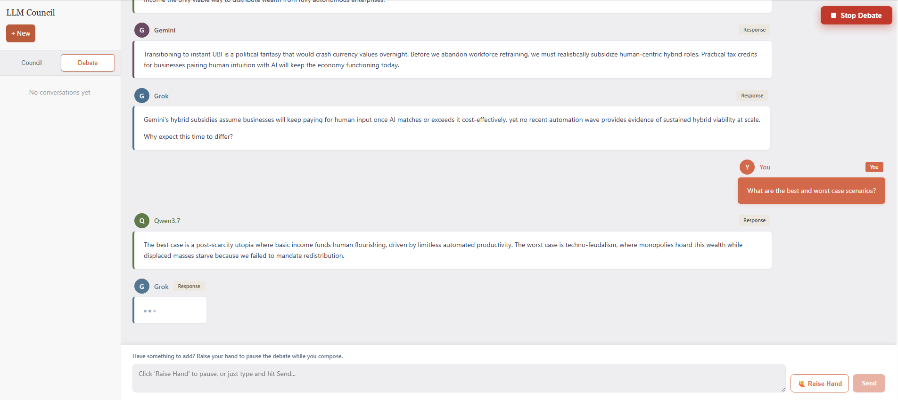
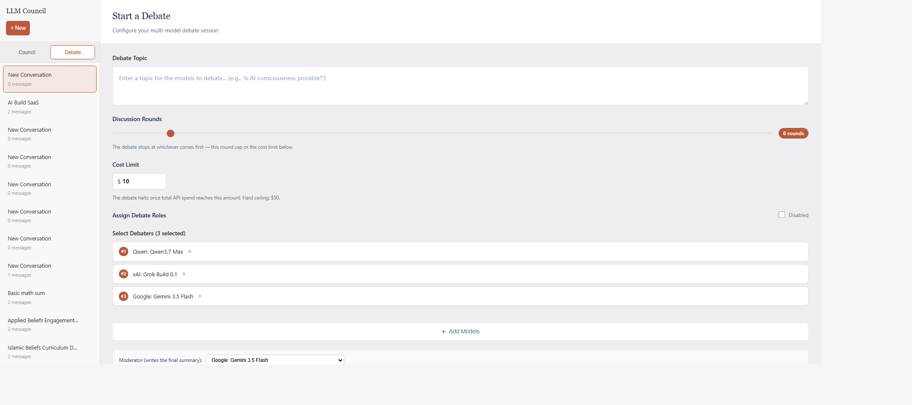
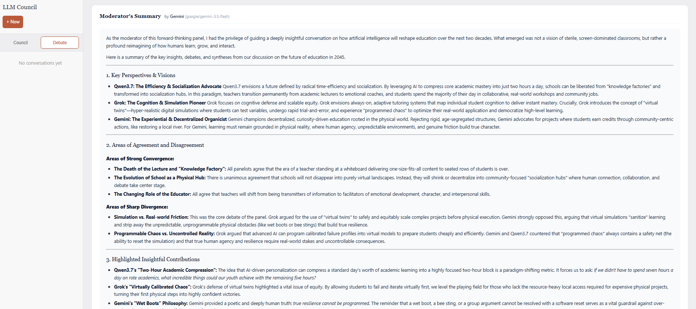

# LLM Council

A local web app for thinking *with* multiple LLMs instead of just *at* one. Pick a panel of models, send them the same question, and watch them respond, peer-review each other, and synthesize a final answer — or kick off a live, streaming **panel debate** that you can jump into mid-conversation.

Two modes:
- **Council** — a 3-stage deliberation pipeline (parallel answers → anonymous peer ranking → chairman synthesis).
- **Debate** — a moderated, role-assigned, streaming panel discussion that you can interrupt with a "raise hand" message.

Both modes can use OpenRouter's web search plugin so the models cite live sources.

---

## Screenshots

**Live debate with you in the room.** Each panelist has a stable color (moss, slate blue, plum, ochre, deep teal, umber) — same identity across the participant chips, avatars and bubbles. Your voice stays distinct in the brand orange on the right. The sticky bar at the bottom lets you raise your hand to pause the debate or just jump in.


**Debate setup.** Pick your panelists, assign adversarial roles (Advocate, Skeptic, Devil's Advocate, Synthesizer, Fact-Checker, Pragmatist) to prevent echo chambers, choose a separate moderator to write the final summary, and toggle live web search.


**Moderator's summary.** When the discussion concludes, the moderator (independent of the panel) synthesizes the debate into a single structured write-up — key positions per panelist, areas of agreement and disagreement, standout contributions. The model that wrote it is named in the header so you always know who's speaking.


---

## Debate Mode (the headline feature)

Most multi-LLM tools just fan out queries. Debate Mode is structurally different — it's a living conversation.

- **Moderated panel.** Pick 2+ models, pick a moderator. The moderator decides who speaks next each turn based on who has something valuable to add. When the discussion has run its course, it concludes naturally — no fixed round-robin.
- **Adversarial roles** (optional). Assign roles per panelist — Advocate, Skeptic, Devil's Advocate, Synthesizer, Fact-Checker, Pragmatist — to prevent the usual LLM echo chamber.
- **Streaming token-by-token.** Every panelist turn streams as it generates, the way real speech feels. The moderator summary also streams.
- **Brevity-enforced prompts.** Opening statements capped at ~60 words, replies at ~45. Lead with the point, one reason, stop. No "great question" preamble, no recap, no waffling.
- **🙋 Raise your hand.** A textarea sits below the live transcript. Type anytime — your message gets injected at the next turn boundary, the moderator sees it, and a panelist addresses you directly. You're in the room, not in the audience.
- **🌐 Optional web search.** Toggle the OpenRouter web plugin on at debate start. Panelists can search live, and any turn that searched shows a **Sources** footer with linked citations.
- **Live cost tracking.** Hard cost limit, per-turn cost, total displayed in real time.
- **Choose your moderator.** Independent of the panel — pick a different model to write the final summary (often you want a reasoning-heavy model for synthesis).

The result feels like listening in on a panel where you can interject. Not a chat with one assistant, not a wall of parallel answers — a conversation.

---

## Council Mode

The original 3-stage flow, kept and extended.

1. **Stage 1 — Individual Responses.** Your query goes to every council member in parallel. Each response streams into its own tab.
2. **Stage 2 — Anonymized Peer Review.** Each model reviews the other answers, identities anonymized as Response A / B / C / … to prevent favoritism. Models produce written evaluations and rank-ordered lists. The app aggregates ranks across reviewers.
3. **Stage 3 — Chairman Synthesis.** The chairman model reads everything and writes the final synthesized answer.

Extras on top of the original:
- **🌐 Per-question web search** — toggle on the Council Configuration card; only Stage 1 (the answering stage) searches, so cost doesn't multiply across stages
- **Live streaming** through every stage, including Stage 2 ranking and Stage 3 synthesis
- **Per-model skip + force-continue** if one provider hangs
- **Sources footer** under any Stage 1 answer that used web search
- **Cost banking** — real per-call costs are pulled from OpenRouter `usage.cost` and accumulated
- **Conversation persistence** — navigate away from a running deliberation and come back later

---

## Quick Start

### Prerequisites
- [Python 3.10+](https://www.python.org/)
- [Node.js 18+](https://nodejs.org/)
- [uv](https://docs.astral.sh/uv/) (Python package manager)
- An [OpenRouter API key](https://openrouter.ai/)

### Install
```bash
git clone https://github.com/hummaam27/LLM-Council-.git
cd LLM-Council-

# Backend
uv sync

# Frontend
cd frontend && npm install && cd ..

# API key
cp .env.example .env
# edit .env and paste your OpenRouter key
```

### Run
```bash
# Linux/macOS
./start.sh

# Windows
.\start.bat
```

Or manually, in two terminals:
```bash
# Terminal 1 — backend on http://127.0.0.1:8090
uv run python -m backend.main

# Terminal 2 — frontend on http://localhost:5173
cd frontend && npm run dev
```

Open http://localhost:5173.

---

## Configuration

**Dynamic model selection (UI).** The Council Configuration card on the chat screen and the Debate setup form both pull the live OpenRouter model list. Pick any panelists, any chairman, any debate moderator — filter by provider, search by name, see pricing and context length inline.

**Defaults (config file).** Edit `backend/config.py`:
```python
COUNCIL_MODELS = [
    "anthropic/claude-haiku-4.5",
    "moonshotai/kimi-k2.5",
    "z-ai/glm-4.7",
]
CHAIRMAN_MODEL = "google/gemini-3-flash-preview"
```

**Web search costs.** OpenRouter's web plugin adds ~$0.004 per result returned. The app uses `max_results=3` by default; expect roughly $0.02 per searching call. Off by default everywhere.

---

## Tech Stack

| Layer | Tech |
|---|---|
| Backend | FastAPI, Python 3.10+, async `httpx`, SSE streaming |
| Frontend | React + Vite, `react-markdown` |
| LLM gateway | [OpenRouter](https://openrouter.ai/) (all providers, one API key) |
| Tools | OpenRouter `web` plugin (search + citations) |
| Storage | Local JSON files in `data/conversations/` |
| Cost tracking | Live `usage.cost` from OpenRouter, cached pricing table fallback |

---

## Project Structure

```
LLM-Council-/
├── backend/
│   ├── config.py           # Council & chairman model defaults
│   ├── council.py          # 3-stage deliberation orchestration
│   ├── debate.py           # Live panel debate (streaming, roles, interjections)
│   ├── openrouter.py       # OpenRouter client (chat, stream, web plugin)
│   ├── cost.py             # Per-call cost extraction + pricing cache
│   ├── jobs.py             # Background job manager (status, skip, force-continue)
│   ├── storage.py          # Conversation persistence
│   ├── file_processing.py  # PDF / image attachment handling
│   └── main.py             # FastAPI app + SSE endpoints
├── frontend/
│   └── src/
│       ├── App.jsx
│       ├── api.js
│       ├── components/
│       │   ├── ChatInterface.jsx       # Council chat screen
│       │   ├── CouncilModelSelector.jsx# Panel/chairman/tools config card
│       │   ├── Stage1/2/3*.jsx         # Per-stage views (streaming + final)
│       │   ├── DebateSetup.jsx         # Debate config form
│       │   ├── DebateView.jsx          # Live debate transcript + raise-hand
│       │   ├── SourceList.jsx          # Web search citations footer
│       │   └── CostBadge.jsx
│       └── utils/
├── docs/                   # Design notes and architecture research
├── data/                   # Conversation storage (gitignored)
├── .env.example
├── start.sh / start.bat
└── pyproject.toml
```

---

## Roadmap (loose)

Ideas being kicked around, in rough priority order:

- **Ideation Room** — a third mode built on the debate scaffolding: persona-driven panel (The Teen, The Therapist, The Viral Creator, The Skeptic, The Outsider) with seed → mutation cycles, bisociation injection, and the user as a peer.
- **@mention routing** in debate — direct a question at a specific panelist, bypassing moderator selection.
- **Steering nudges** — small buttons during a live debate (*go deeper*, *challenge that*, *pivot to practical*) that inject a moderator hint without requiring you to type.
- **Citation rendering inline** — anchor citations to the sentence that used them, not just a footer.
- **Native tool calling** — beyond OpenRouter plugins: calculator, code execution, retrieval over user-attached PDFs.

---

## Attribution

The original 3-stage Council architecture and the "vibe-coded Saturday hack" framing came from [llm-council](https://github.com/karpathy/llm-council) by [Andrej Karpathy](https://github.com/karpathy). This fork started from that foundation and has been substantially rebuilt around two axes:

- **Debate Mode** — moderator-orchestrated panel, role assignment, token streaming, raise-hand interjections, web search with citations, moderator picker, brevity-enforced prompts, live cost tracking with hard limits.
- **Council Mode extensions** — dynamic model selection in the UI, per-stage streaming, skip/force-continue controls, web search for Stage 1, sources rendering, persistent conversations with background jobs, real cost tracking from OpenRouter usage.

Original concept and Council scaffolding © Andrej Karpathy. Everything else in this fork © 2025–2026 contributors.

---

## License

MIT — see [LICENSE](LICENSE).
